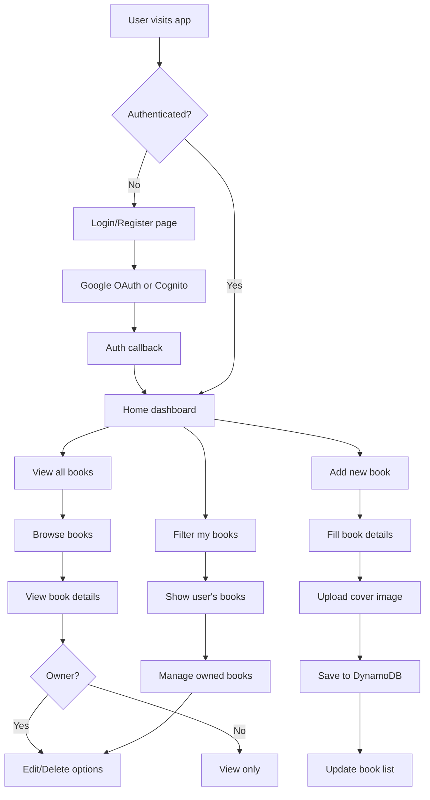

# BookClub - Serverless Book Sharing Platform

A modern, serverless book club application where users can upload books they own and share them with others. Built with AWS Lambda, API Gateway, DynamoDB, S3, and Cognito for zero ongoing costs when not in use.

## Technologies Used

This project leverages a modern, cloud-native technology stack:

### Frontend (TypeScript - 51.4%)
- **React 19** with TypeScript for type-safe component development
- **Tailwind CSS** for responsive, utility-first styling
- **React Router DOM** for client-side routing and navigation
- **Axios** for HTTP API communication
- **Headless UI & Heroicons** for accessible, customizable UI components

### Backend (JavaScript - 32.7%)
- **AWS Lambda** functions with Node.js runtime for serverless compute
- **Serverless Framework** for infrastructure deployment and management
- **AWS SDK** for seamless integration with AWS services
- **UUID** library for unique identifier generation

### Infrastructure as Code (HCL - 10.4%)
- **Terraform** for managing AWS infrastructure resources
- **AWS API Gateway** custom domain configuration
- **Route 53** DNS management and SSL certificates
- **S3** and **DynamoDB** resource provisioning

### DevOps & Deployment (Shell - 2.8%)
- **Shell scripts** for automated deployment pipelines
- **GitHub Actions** workflows for CI/CD
- **AWS CLI** integration for cloud resource management

### UI Assets (HTML - 1.7%, CSS - 1.0%)
- **HTML5** templates and public assets
- **CSS3** for custom styling and animations
- **Responsive design** for mobile and desktop compatibility

## Architecture

- **Frontend**: React with TypeScript and Tailwind CSS
- **Backend**: AWS Lambda functions with Node.js
- **Database**: DynamoDB (pay-per-request)
- **Authentication**: AWS Cognito with OAuth integration
- **File Storage**: S3 for book cover images
- **API**: AWS API Gateway with custom domain
- **Infrastructure**: Terraform for resource management
- **Deployment**: Serverless Framework + GitHub Actions

## User Flow Diagram



## Features

- **User Management**: Registration and authentication with AWS Cognito
- **Book Catalog**: Add, edit, and delete books with cover images
- **File Uploads**: Secure image uploads using S3 pre-signed URLs
- **Filtering**: View all books or filter by ownership
- **Responsive Design**: Optimized for mobile and desktop devices
- **Real-time Updates**: Dynamic UI updates without page refreshes

## Setup Instructions

### Prerequisites

- Node.js 18+ installed
- AWS CLI configured with appropriate permissions
- Serverless Framework CLI (`npm install -g serverless`)

### Backend Setup

1. Navigate to the backend directory:
   ```bash
   cd bookclub-app/backend
   ```

2. Install dependencies:
   ```bash
   npm install
   ```

3. Deploy to AWS:
   ```bash
   serverless deploy
   ```

4. Note the API URL from the deployment output.

### Frontend Setup

1. Navigate to the frontend directory:
   ```bash
   cd bookclub-app/frontend
   ```

2. Install dependencies:
   ```bash
   npm install
   ```

3. Create a `.env` file with your API URL:
   ```bash
   cp .env.example .env
   ```
   
4. Update the `.env` file with your actual API Gateway URL from the backend deployment.

5. Start the development server:
   ```bash
   npm start
   ```

## Local Development

To run the backend locally:

```bash
cd bookclub-app/backend
serverless offline start
```

This will start the API at `http://localhost:4000`.

## Deployment

The application is designed to be completely serverless with zero ongoing costs when not in use. Use the automated deployment script:

```bash
cd bookclub-app
./deploy.sh
```

This script will:
1. Deploy the backend infrastructure
2. Build and configure the frontend
3. Set up custom domains and SSL certificates

## Cost Effectiveness

This BookClub application is engineered for maximum cost efficiency through strategic technology choices and cloud-native architecture:

**Pay-Per-Use Model**: All AWS services operate on consumption-based pricing, meaning you only pay for actual usage rather than provisioned capacity. When the application is idle, costs drop to nearly zero.

**Free Tier Benefits**:
- **DynamoDB**: 25 GB storage, 25 WCU, 25 RCU monthly
- **Lambda**: 1M requests and 400,000 GB-seconds monthly
- **API Gateway**: 1M API calls monthly  
- **S3**: 5 GB storage and 20,000 GET requests monthly
- **Cognito**: 50,000 monthly active users

**Infrastructure Optimization**:
- **Serverless Architecture**: Eliminates server management overhead and idle resource costs
- **Terraform**: Infrastructure as Code reduces manual provisioning time and human errors
- **Open Source Stack**: No licensing fees for React, Node.js, or Serverless Framework
- **Edge-Optimized Delivery**: CloudFront integration ensures global performance without additional infrastructure

**Operational Efficiency**:
- **Automated Deployments**: GitHub Actions and shell scripts minimize manual deployment effort
- **Managed Services**: AWS handles scaling, security patches, and maintenance automatically
- **TypeScript**: Reduces debugging time and improves development velocity through type safety

For most small to medium book clubs, the application will operate entirely within AWS free tier limits, resulting in near-zero operational costs while maintaining enterprise-grade scalability and reliability.

## Security Features

- **JWT-based Authentication**: Secure token-based auth with AWS Cognito
- **Protected API Endpoints**: All write operations require authentication
- **Secure File Uploads**: Pre-signed URLs prevent unauthorized access
- **User Ownership Validation**: Users can only modify their own books
- **HTTPS Everywhere**: SSL/TLS encryption for all communications
- **CORS Configuration**: Properly configured cross-origin resource sharing

## API Endpoints

### Authentication
- `POST /auth/register` - Register new user
- `POST /auth/login` - User login

### Books
- `GET /books` - List all books (with optional userId filter)
- `POST /books` - Create new book (authenticated)
- `GET /books/{bookId}` - Get specific book
- `PUT /books/{bookId}` - Update book (authenticated, owner only)
- `DELETE /books/{bookId}` - Delete book (authenticated, owner only)

### Files
- `POST /upload-url` - Generate pre-signed URL for image upload (authenticated)

### User
- `GET /users/me` - Get current user profile (authenticated)

## Contributing

1. Fork the repository
2. Create a feature branch: `git checkout -b feature-name`
3. Make your changes and test thoroughly
4. Commit with descriptive messages: `git commit -m "Add feature description"`
5. Push to your fork: `git push origin feature-name`
6. Create a Pull Request

## License

This project is licensed under the ISC License.